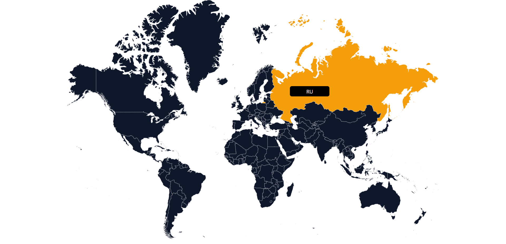

# World Map

[WorldMap](https://github.com/kushadige/world-svg) is an svg component for [React](https://reactjs.org). Renders a responsive world map. It is customizable, works great with tiny screens and can be styled to match any design.



### Installation

```shell
npm install world-svg  # using npm
yarn add world-svg     # using yarn
```

### Example

```tsx
import { WorldMap } from 'world-svg';

function App() {
  return (
    <WorldMap />
  );
}

export default App;
```

### `WorldMap` props

| Attribute      |     Type     |  Default  | Description  |
| :------------- | :----------: | :-------: | :------------------------------------------------------------------------------------------------------------- |
| tooltip               |   `string`   |    `on`     | Specify tooltip whether on or off                       |
| landColor             |   `string`   |  `#2db7f5`  | Country color.                                          |
| hoverColor            |   `string`   |  `#2db7f5`  | Country color on hover.                                 |
| landBorder            |   `string`   |  `#2db7f5`  | Color for Country borders.                              |
| tooltipBgColor        |   `string`   |  `#2db7f5`  | Tooltip background color.                               |
| tooltipTextColor      |   `string`   |  `#2db7f5`  | Tooltip text color.                                     |
| onCountryClick        |  `function`  |   `null`    | Event function that triggered on specific country click. It can take an argument in order to receive clicked country alpha-2 code. |

### `onCountryClick` Example

```tsx
import { WorldMap } from 'world-svg';

const handleCountryClick = (countryId) => {
  console.log(countryId);  // Outs: RU, TR, US, ... etc.
}

function App() {
  return (
    <WorldMap onCountryClick={handleCountryClick} />
  );
}

export default App;
```

